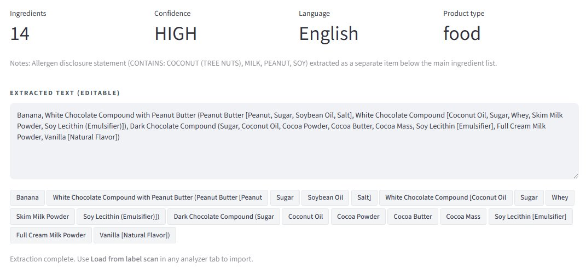

<div align="center">

# 🔬 SafeScan

### Consumer Product Ingredient Safety Analyzer

**Four independent risk lenses across cosmetics, personal care, household, and food**
*Powered by Claude Sonnet 4.6 · Grounded in regulatory and clinical literature*

[](https://python.org)
[](https://streamlit.io)
[](https://anthropic.com)
[](https://opensource.org/licenses/MIT)

</div>

---

<div align="center">


</div>

## 🎯 What is SafeScan?

SafeScan reads an ingredient list from any consumer product — cosmetic, personal care, household, or food — and returns **four independent safety assessments** grounded in published regulatory and clinical references. A separate label-scan utility extracts ingredients from a photo once, so vision OCR runs a single time per product before driving multiple analyses against the same text.

### Why it exists

Consumer product labels list ingredients in INCI names and food-additive codes that most people cannot interpret. Existing apps (Yuka, Think Dirty, EWG Skin Deep) rely on opaque scoring rubrics. SafeScan instead exposes:

- 📚 **Which regulatory or clinical reference** drives each flag
- 🔍 **Per-ingredient transparency** — every finding shows its classification, concern, and (where relevant) a safer alternative
- 🧭 **Four orthogonal lenses** so users see context-dependent risk — e.g. an ingredient that is environmentally problematic but pediatrically safe

---

## ✨ Features

| Module | Focus | Key references |
|---|---|---|
| 📷 **Label Scan** | Vision-based ingredient extraction (one call, four analyses) | Claude Sonnet 4.6 vision |
| ⚠️ **Allergens & Irritants** | Contact allergens, sensitizers, irritants, food allergens | EU 1223/2009 Annex III · FDA FALCPA + FASTER Act · EU 1169/2011 Annex II · NACDG · ACDS Allergen of the Year |
| 🧬 **Endocrine Disruptors** | Estrogenic, anti-androgenic, thyroid-active substances | EU 2018/605 · EPA EDSP · Endocrine Society Scientific Statement · EFSA · pesticide residue data |
| 🤰 **Pregnancy & Pediatric** | Teratogens, lactation, infant/child restrictions, dietary risks | FDA PLLR · ACOG · AAP · FDA/EPA fish advisory · CDC listeriosis prevention |
| 🌊 **Environmental Impact** | Aquatic toxicity, reefs, persistence, microplastics, deforestation, carbon | NOAA reef guidance · Hawaii Act 104 · EU REACH PBT/vPvB · EU 2023/2055 · RSPO · Monterey Bay Seafood Watch |

Every analyzer returns the **same unified JSON schema**, so the frontend renders all four with a single component.

---

## 📸 Workflow

### 1. Upload a product label

The Label Scan tab accepts any photo of a packaging panel. The example below uses an Aldi "Bananas Covered in Dark Chocolate and Peanut Butter" snack (a food product, but the same flow works for cosmetics and household items).

<p align="center">
  
</p>

### 2. Extract ingredients with vision OCR

A single Claude vision call returns a normalized, INCI-compliant ingredient list along with metadata (confidence, language, product type). Allergen disclosure statements (`CONTAINS: ...`) are surfaced separately. The text is editable before being passed to any analyzer.

<p align="center">
  
</p>

### 3. Run any of the four analyzers

Each analyzer reads the same text and produces a structured assessment with an overall verdict, key concerns, per-ingredient findings, and (where relevant) safer alternatives.

<details open>
<summary><b>⚠️ Allergens & Irritants — HIGH (4 FDA Top 9 allergens detected)</b></summary>

<p align="center">
  
</p>
</details>

<details>
<summary><b>🧬 Endocrine Disruptors — MEDIUM (cadmium accumulation from cocoa)</b></summary>

<p align="center">
  
</p>
</details>

<details>
<summary><b>🤰 Pregnancy & Pediatric — LOW (allergen exposure flagged for infants)</b></summary>

<p align="center">
  
</p>
</details>

<details>
<summary><b>🌊 Environmental Impact — MEDIUM (uncertified cocoa, dairy footprint)</b></summary>

<p align="center">
  
</p>
</details>

---

## 🏗️ Architecture

```
                ┌──────────────────────────────────────┐
                │  Streamlit app (frontend/app.py)     │
                │   ─ Sidebar: BYOK + Demo toggle      │
                │   ─ 5 tabs (Label Scan + 4 analyzers)│
                └─────────────────┬────────────────────┘
                                  │  direct function call
                ┌─────────────────▼────────────────────┐
                │  backend/                            │
                │   analyzers/                         │
                │    base.py        (Claude client)    │
                │    allergen.py    endocrine.py       │
                │    pregnancy.py   environmental.py   │
                │   ocr.py          (vision extract)   │
                └─────────────────┬────────────────────┘
                                  │
                          ┌───────▼────────┐
                          │ Anthropic API  │
                          │ Claude Sonnet  │
                          └────────────────┘
```

### Design decisions

| Decision | Why |
|---|---|
| **Single-process Streamlit** (no separate FastAPI service) | One-click deploy to Streamlit Community Cloud, no CORS, analyzers import as plain modules |
| **One OCR call → four analyses** | The user reviews and edits the extracted text once, then runs any subset of analyzers against it — 75% fewer vision API calls vs. naive design |
| **Unified JSON schema across analyzers** | Frontend renders all four with a single component; adding a new analyzer is one file + one tab |
| **Prompt caching (`cache_control: ephemeral`)** | Each analyzer's domain-expert system prompt is well above the 1024-token caching threshold; repeated analyses in the same session hit the cache for lower cost and latency |
| **Bring Your Own Key (BYOK)** | Hosting a free public demo would mean the operator pays for every visitor's API calls; BYOK shifts the (few-cents) cost to the user and removes rate limits |
| **Demo mode with pre-computed samples** | Visitors without a key still see exactly what the app produces — populated from `examples/*.json` and a bundled product photo |

---

## 🔑 Bring Your Own Key (BYOK) & Demo mode

SafeScan does not ship with a hosted API key. You have two ways to use the app:

### Option A — Live mode (BYOK)
1. Sign up at [console.anthropic.com](https://console.anthropic.com)
2. **Settings → API Keys → Create Key**
3. Add a small amount of credit (most analyses cost a few cents)
4. Paste the key into the sidebar when the app loads

The key lives only in `st.session_state` for the current browser tab. Refreshing clears it. It is never logged or stored server-side.

### Option B — Demo mode
Toggle **Demo mode** in the sidebar. The app loads:
- A bundled product label photo
- A pre-computed OCR extraction (`examples/ocr.json`)
- Pre-computed assessments for all four analyzers (`examples/*.json`)

No API key required, no Anthropic API calls are made. Use this to evaluate the app's output quality before deciding whether to plug in your own key.

---

## 🚀 Local setup

### Prerequisites
- Python 3.11+
- An Anthropic API key (entered in the sidebar at runtime)

### Install
```powershell
python -m venv venv
.\venv\Scripts\activate          # macOS/Linux: source venv/bin/activate
pip install -r requirements.txt
```

### Run
```powershell
streamlit run frontend/app.py
```

The app opens at `http://localhost:8501`. Paste your API key into the sidebar (or enable Demo mode) and start.

### Optional: developer-mode auto-load
If you put `ANTHROPIC_API_KEY=sk-ant-...` in a local `.env`, the sidebar will be pre-filled. The `.env` file is gitignored. **Do not** use this pattern when deploying to Streamlit Community Cloud — the deployed app is BYOK by design.

---

## ☁️ Deploy to Streamlit Community Cloud

1. Push this repo to GitHub
2. Sign in at [share.streamlit.io](https://share.streamlit.io) with your GitHub account
3. **New app** → select the `eunsoo-suk/Safe-Scan` repo
4. Main file path: `frontend/app.py`
5. Python version: 3.11+
6. **Do not add any secret named `ANTHROPIC_API_KEY`** — leaving it empty is what makes the demo BYOK
7. **Deploy**

Streamlit Cloud installs from `requirements.txt`, runs `streamlit run frontend/app.py`, and serves the app at `https://<your-app-name>.streamlit.app`. Visitors enter their own key in the sidebar.

### Pre-deployment checklist
- [ ] `.env` is in `.gitignore` and not in the git history (`git log -- .env` is empty)
- [ ] `.env.example` contains a placeholder, never a real key
- [ ] Any key shown in screenshots, screen-shares, or chat history has been revoked at console.anthropic.com
- [ ] `README.md` renders correctly on GitHub
- [ ] Demo mode works end-to-end with a fresh browser session

---

## 📁 Project layout

```
Safe Scan/
├── frontend/
│   └── app.py                     # Single-file Streamlit application
├── backend/
│   ├── analyzers/
│   │   ├── base.py                # Shared Claude client, JSON parsing, prompt caching
│   │   ├── allergen.py            # Allergens & irritants (topical + food)
│   │   ├── endocrine.py           # Endocrine disruptors (cosmetic + dietary)
│   │   ├── pregnancy.py           # Pregnancy & pediatric (topical + dietary)
│   │   └── environmental.py       # Environmental impact (aquatic + climate)
│   ├── ocr.py                     # Vision-based ingredient extraction
│   └── main.py                    # DEPRECATED — old FastAPI entry, now stub
├── examples/                      # Pre-computed JSON samples for Demo mode
│   ├── ocr.json
│   ├── allergen.json
│   ├── endocrine.json
│   ├── pregnancy.json
│   └── environmental.json
├── docs/images/                   # README screenshots
├── sample image.jpg               # Bundled product label for Demo mode
├── requirements.txt
├── .env.example                   # Placeholder; never real keys
├── .gitignore
└── README.md
```

---

## 🧰 Tech stack

| Layer | Choice |
|---|---|
| LLM | Claude Sonnet 4.6 (Anthropic API) |
| App framework | Streamlit (single-process, BYOK) |
| Vision OCR | Claude Sonnet 4.6 vision capability |
| Caching | Anthropic ephemeral prompt cache |
| Language | Python 3.11+ |

---

## 🛠️ How it was built

The project went through three iterations before landing on the current shape:

1. **v1 — Single-purpose carcinogenicity analyzer** with a FastAPI backend and a separate React-style frontend. Removed: too much surface area for a single safety lens, and CORS/deployment friction made the demo unfriendly.

2. **v2 — Two analyzers (carcinogenicity + genotoxicity)**, still split across FastAPI + frontend. Removed: the two lenses overlapped heavily, and operating two services for a hackathon-scale app was overkill.

3. **v2.1 (current)** — Restructured to **four orthogonal analyzers** (allergens, endocrine, pregnancy, environmental) covering both topical and dietary exposures. Frontend and backend merged into a single Streamlit process. Vision OCR factored out into its own utility tab so one extraction drives multiple analyses.

Throughout, the goal was to keep the **regulatory provenance** visible: every finding should let the user audit which standard or clinical reference drove the flag. The system prompts in `backend/analyzers/*.py` encode those references explicitly.

---

## ⚖️ Responsible-use notes

- SafeScan is **informational**. It is not a medical, legal, or regulatory product. The UI footer states this.
- The analyzers reason from the LLM's training data and the regulatory references encoded in each system prompt. They do **not** query live regulatory databases at inference time, so assessments reflect the state of the literature up to the model's knowledge cutoff.
- The model can be wrong. Two safeguards: ingredient-level transparency (each finding shows its claimed classification and concern, so the user can audit it), and an explicit disclaimer in the UI.
- No ingredient list or image is persisted by this application. All inputs live only in process memory while the session is active.
- API keys are read from the sidebar `st.session_state` and never logged or stored.

---

## 📄 License

MIT. See `LICENSE` if added; otherwise treat as personal/portfolio code.

---

<div align="center">

Built by **[Eunsoo Suk](https://github.com/eunsoo-suk)** · MS Applied Machine Learning · University of Maryland

</div>
